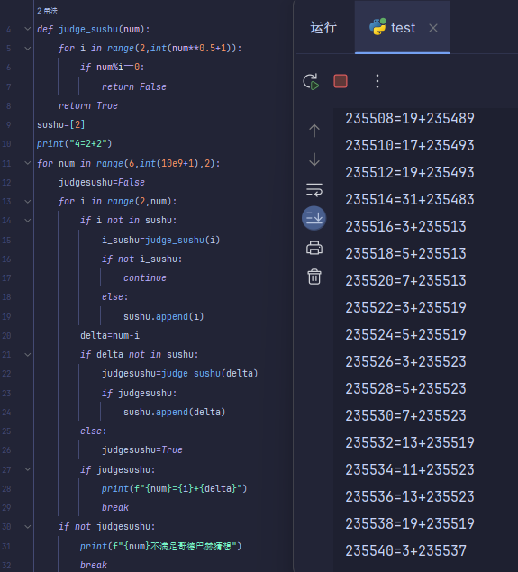
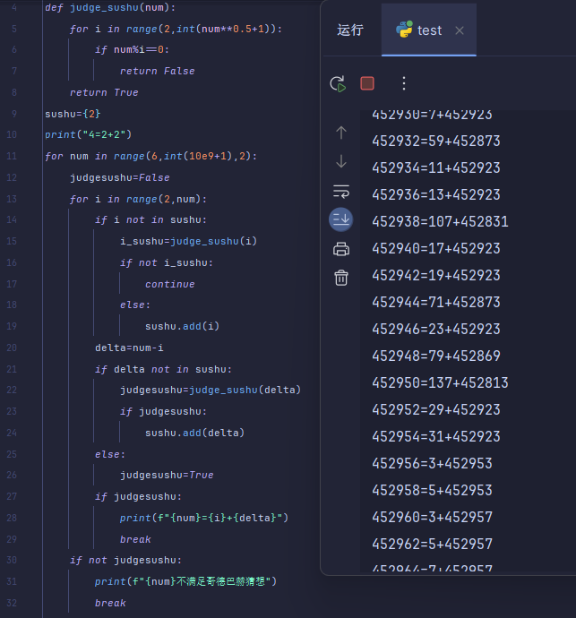
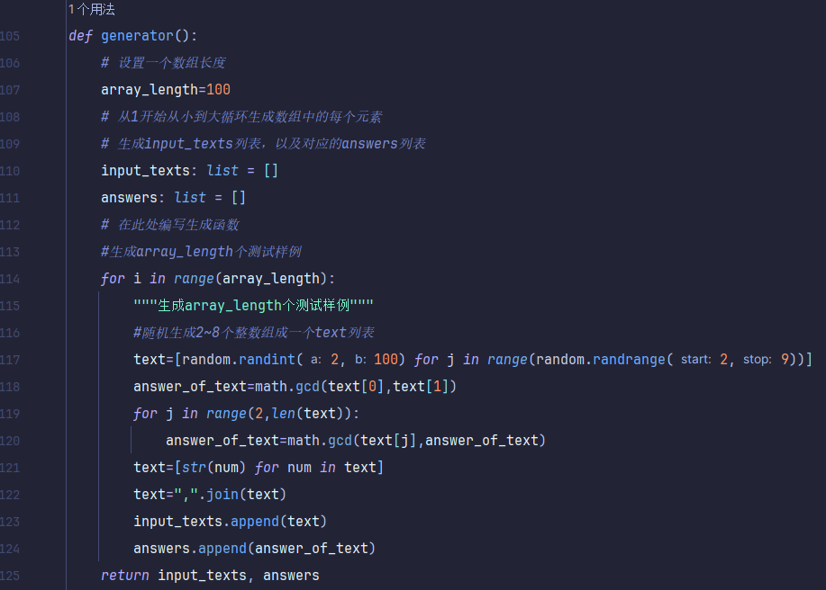
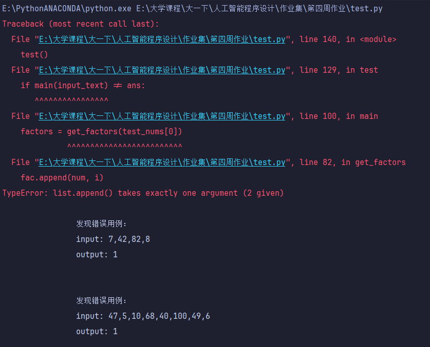
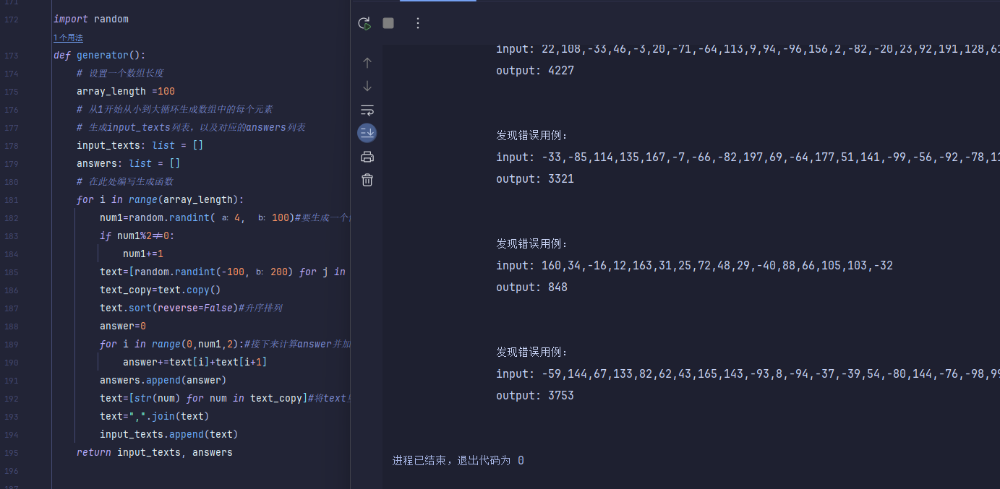

# 第四周问答作业
## 朱士杭 231300027
### 2024.03.21

## 问题一：
### （1）动态参数列表如何实现：通过将传入的参数
（主要有位置参数和关键字参数两种传参方法）打包成元组， 
将位置参数即不带有形参名的实参打包成一个元组传递给*args 
将关键字参数带有形参名的实参打包成一个带有键值对的字典传递给**kwargs 
然后在函数内部对args与kwargs进行解包通过遍历进行操作 
### （2）kwargs的用法及其在函数定义中的意义：
接下来写一个函数打印所有的键值对 
def print_all(**kwargs): 
&emsp;for (k,v) in kwargs.items(): 
&emsp;&emsp;print(f"键为：{k} 值为：{v}") 
\**kwargs在函数定义的时候就承担着接收一系列未知个数的键值对任务， 
当调用函数的时候，会传入一系列 关键字参数=实参 的用法，函数会将这些键值打包成一个字典传给kwargs， 
而\**的标记就让python标识kwargs是用于接收未知个数的关键字参数 

## 问题二：
代码如图分别为优化前的代码和优化后的代码，
很明显优化前的代码相比与优化后的代码会慢很多
 
 
主要优化思路： 
我认为验证哥德巴赫猜想的算法复杂度是O(N^2)，因为第一层循环需要遍历10^9以内所有的偶数，还要验证i+j里面i是否为质数，j是否为质数 
我优化的思路在于生成一个素数的集合sushu_set，如果i在里面直接判断j即可，如果i不在判断完i以后将其加入sushu_set即可（判断是否在集合里比列表快多了） 
后来又想了想感觉还可以再优化，于是通过观察可以发现，i<j并且i范围一般在10^5以内因此不妨先生成0~10^5以内所有的质数列表然后遍历这个列表即可 

## 问题三：8-puzzle滑动拼图游戏
 
不知道为什么最后一直都显示不出来，我用了最暴力的BFS算法，把9!种可能全都列举了一遍 
结果程序就爆掉了，之后我自己再给程序修改修改，将BFS和DFS结合起来看看能不能优化一下算法 

## 问题四：
 
 
真的很想吐槽两句，这个代码时谁写的，懂不懂什么叫作良好交互？连每个函数的文档和注释都没有绕来绕去快累死了
传参传个什么东西至少写个注释让人看懂吧，名字起了input_text传的是list列表还是一个字符串？
check_minimum函数要干嘛？能不能写个注释让人一目了然这样好修改代码啊
写测试样例那个注释也不知道想让我干啥  比如“# 从1开始从小到大循环生成数组中的每个元素” 这是要干嘛？？？？
看了半天才知道这个check_minimum是用来判断第一个数是否能被其他的数整除，写个注释不行吗？
我的评价是：如果要我来修改这个代码，真的不如让我再重写一个（大无语）
反正让我写测试样例代码也写出来了，能输出错误的样例，但是为啥这也能报错我就不知道了，我只能说原来的代码写的真垃圾
后来呢细细看了一下代码，发现出错的地方在于“fac.append(num, i)”这一句，谁写的破代码，append里面传一个参数不知道吗？
要么就分开来写，要么就别写这一句，一直想不明白这一句是干嘛的 
以上只是自己的一些碎碎念，敬请忽略，源代码问题有这么几个：
①list(set(fac)).sort()这里不应该list()和set()强制类型转换一下，应该改为两句：
fac=set(fac) 
fac.sort()这么写就对了 
②fac.append(num, i)这一句代码删掉，纯粹没有任何用处 

## 问题五：
生成测试样例代码如下：
 
不想改这个代码，写的太烂了真的不如自己重新写一个 
虽然但是最后通过自己仔细查看发现list(s).sort()这一句代码有问题 
这里list(s)相当于对s强制类型转换后给一个新的对象，再sort不改变s 
应当改为s.sort() 
而且result返回的时候str()强制类型转换了一下，我不是非常明白为什么要这么做 
