# 人工智能程序设计大作业之掼蛋
# 阶段二项目设计报告


## 实现目标：基于数据驱动实现AI的自动打牌 ##
## 实现方式：利用Pytorch框架搭建神经网络作回归预测 ##
## 环境依赖：
### Pygame工具包<br>NumPy模块<br>Pandas模块<br>Pytorch库<br>Random模块 ###
请在所有.py文件当中都在前面写上插入以下代码
```python
import numpy as np
import pandas as pd
import pygame
import random
import torch
import torch.nn as nn
from torch.utils.data import Dataset
import torch.optim as optim
```
在“掼蛋Stage2.py”文件当中另外还需要插入代码导入神经网络架构
```python
from NeuralNetwork import NetWork
```
## 思路介绍： ##
&nbsp; &nbsp; &nbsp; &nbsp; 在第一阶段已经实现了AI由规则决定每一次与玩家对战需要出什么牌，并且在第一阶段的项目报告中已经详细说明了掼蛋游戏的规则，
因此在第二阶段的报告当中就不再赘述了，我想把更多的篇幅留给我的实现过程。在第二阶段我打算
突破一下自我，尝试一下使用神经网络进行回归拟合，预测AI在本回合出什么牌得到的收益（最可能赢概率）最大。<br>
&nbsp; &nbsp; &nbsp; &nbsp; 一开始本来是计划使用强化学习当中的DQN算法去实现的，但是在实现过程中发现了几个问题，第一就是学习成本过高，
需要从头开始学习一遍Q-Learning算法以及改进版本的DQN算法难度太大；第二是对于数据预处理以及目标网络与Q网络徒手搭建框架以及网络模型有些麻烦；
第三就是能力时间安排问题，大作业第二阶段的ddl设定在5月28号，当我开始着手写第二阶段大作业的时候是在5月11号，这个时候我的水平只是初学numpy，
一点机器学习算法都不会，更别提pandas使用、数据预处理、特征工程等一系列细节问题。经过很长时间的内心挣扎与斗争，我不得不将难度降低，选择比较简单
易懂的神经网络去做回归任务。而且在完成大作业项目的过程中也遇到了许许多多全新的问题，最后预测的结果也不尽如人意，但是作为对于新奇事物的尝试，
我在这个过程当中确实收获了很多，不论结果如何，在这个过程当中，我已经问心无愧了。<br>
&nbsp; &nbsp; &nbsp; &nbsp; 好了废话不多说了，我就先大致介绍一下在第二阶段我的大致思路和想法吧。<br>
&nbsp; &nbsp; &nbsp; &nbsp; 其实思路与想法非常简单，对于AI每一步出牌我都会给予一个Q值，说白了就是一种奖励，如果说最终AI获胜了，
那么这一步出牌给予的奖励就会很大，如果输了，奖励会很小（其实按理来说还需要加上一个判断其某一步是否明显出错了来给予相应的惩罚，
但是太复杂了我短时间内没有办法写出一个程序来完善，只能说等以后再说吧）<br>
&nbsp; &nbsp; &nbsp; &nbsp; 在有了Q值的情况下，我准备搭建一个神经网络，通过目前玩家出的牌序列、手中有的牌序列以及对方手里有的牌序列以及回合数，
将这四个作为特征组合成一个输入向量输入进神经网络并且开始训练，得到的预测结果（其中预测胜负其实是一个分类问题，预测Q值其实是一个回归问题）<br>
&nbsp; &nbsp; &nbsp; &nbsp; 在训练好了神经网络之后，将这个神经网络保存，并且应用于第一阶段已经写好的可视化版本的AI对战，每一次与玩家对战的时候，
AI先判断是否为起牌阶段，如果是起牌阶段，则更新目前手中的牌的组合combination，需要将所有可以出的牌连同自己与玩家的手牌组合成向量传进神经网络当中；
如果是跟牌阶段，则需要根据玩家上一回合出了什么牌来决定这一轮可以出什么类型的牌，将每一个允许出的牌（注意需要先判断有没有可以出的牌）都传进神经网络当中，
最后根据得到的Q值选出Q值最高的那个出牌方式并返回给AI让其出牌。
&nbsp; &nbsp; &nbsp; &nbsp; 补充说明：由于玩家最多只可能出6张牌，因此我将出牌序列设定为一个1*6的ndarray数组，并且将3到大王分别映射到一个数字3到17，
不出的地方用0补齐，比如555444表示为[5 5 5 4 4 4]，比如88866表示为[8 8 8 6 6 0]，比如“不出”表示为[0 0 0 0 0 0]，并且顺序都是从大到小
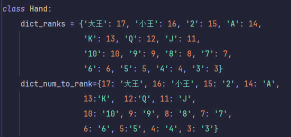<br>

## 项目子阶段： ## 
&nbsp; &nbsp; &nbsp; &nbsp; 在第二阶段我主要将项目分为3个子阶段来完成，分别是生成掼蛋数据集、搭建并训练神经网络、使用神经网络进行预测。
这里顺便哭个惨，怎么写大作业既要当前端又要当后端，既要生成数据集又要担任测试，我深刻体会到了分工的重要性
### 1. 生成掼蛋数据集 ###
&nbsp; &nbsp; &nbsp; &nbsp; 在这个子阶段当中，利用程序设计当中讲到的面向对象编程的思路，构建了Hand手牌类和Player玩家类，在类下面构建成员和方法，
编写两个AI1和AI2，让它们自己与自己对战，并生成相应的数据集。<br>
核心思路也是相当简单，利用在阶段一的一些残留的框架，由于不需要可视化因此可以直接上手对战。<br>
&nbsp; &nbsp; &nbsp; &nbsp; 在这个阶段中遇到的最大的一个问题就是，对NumPy模块使用不是非常熟练，导致需要一边开发一边学新的知识，
比如numpy如何合并ndarray数组，ndarray结构化要求极强， 判断ndarray为空需要使用.any()方法，如何将ndarray再重新转换为内置list数组等一系列的问题，
我现在记忆犹新，这个"生成掼蛋数据集.py"模块当时写了足足8个小时，到了晚上最后11点的时候跑通了，
但是第二天复盘的时候仔细检查并输出每一个结果才发现有严重致命错误，比如在AI1出了[13 13]之后，AI2紧随其后出了[8 8]，
这种情况按理来说是严厉禁止出现的，但是由于numpy模块使用不熟练，一直没有办法判断两个ndarray数组的大小，一直到现在这个问题仍旧没有解决。<br>
&nbsp; &nbsp; &nbsp; &nbsp; 在这个阶段当中最为核心的部分在于对AI1和AI2手牌的拆解，判断其有哪些手牌的组合。这里实现的方式主要用一个list列表去存储，
并且默认存储的顺序为： "单"、"双"、"三同张"、"顺子"、"三连对"、"三带二"、"三同连张"、"炸弹" ，然后list中每一个元素都为一个ndarray数组，
因为每个元素是高度结构化的，但是各个组合之间由于数量不同因此不能构成一个大的ndarray数组，将搜索每个组合的函数定义在大的函数内部，
这样外界就访问不到了，大大增加了程序的安全性，下面给出一个三带二搜索的实例以及整个搜索的框架。<br>
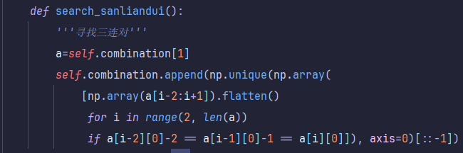<br>
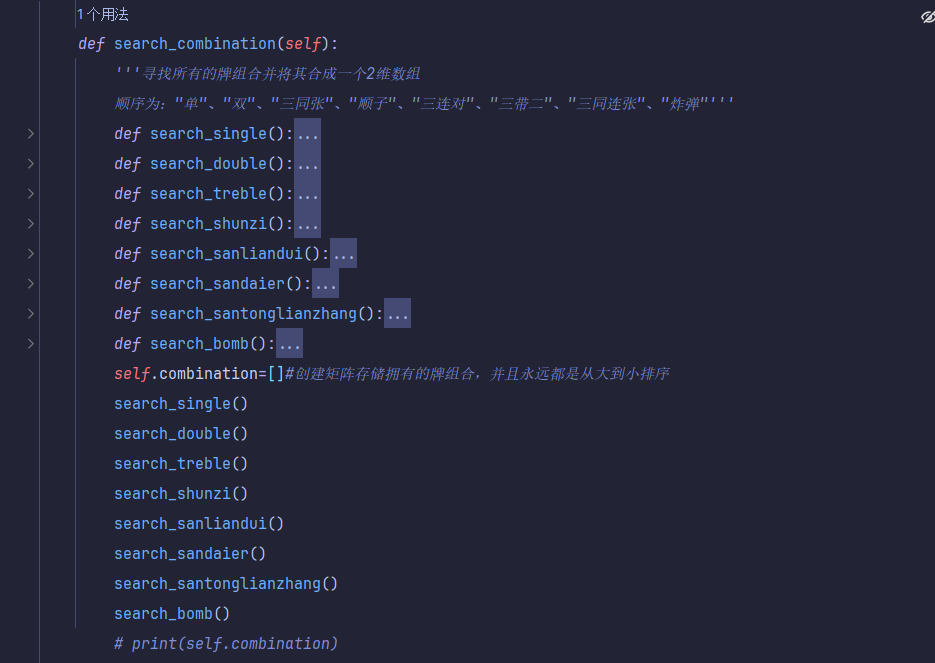<br>
&nbsp; &nbsp; &nbsp; &nbsp; 每一次AI起牌/跟牌阶段都会先搜索有没有可以出的牌，如果没有则直接返回“不出”，如果有的话，则在允许出的牌当中随机挑选，并且有一定概率会出王炸
（这里是依据概率随机出牌与不出，当数据集足够大的时候，这些可以忽略不计），分别定义了两个不同的决策函数initiative()与follow()分别代表起牌阶段与跟牌阶段，
其实说实话我是非常想在这个阶段使用到将函数作为参数传递的，因为这两个函数有相当一部分是重合的，我也非常不喜欢复制粘贴重复无意义工作，奈何我的实力不够，
只能多写一些了。AI之间博弈的代码框架如下（这里先暂时展示一段follow()函数的实现框架，initiative()函数比follow()函数还简单这里就不再展示了）：
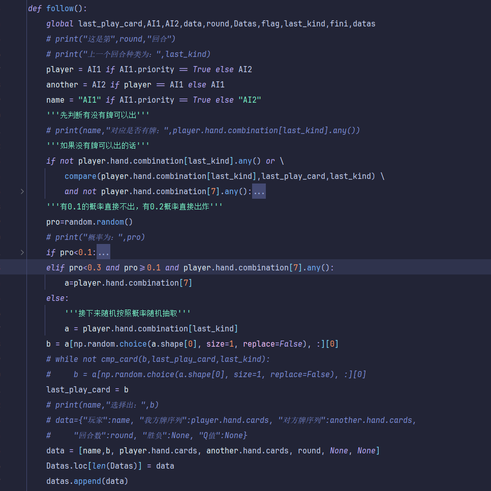<br>
&nbsp; &nbsp; &nbsp; &nbsp; 另外在global frame当中的实现逻辑为，每个AI都有一个牌权的属性，一开始先随机设定某个玩家拥有牌权，开始进入一个大的while循环当中，直到某个玩家胜利才跳出，
然后拥有牌权的玩家开始执行initiative()函数，交换牌权，然后进入一个新的while函数当中吗，另一名玩家选择出牌，直到某一个玩家“不出”，跳出当前while循环，
在大的while循环下继续起牌，否则仍然继续互相出牌博弈。
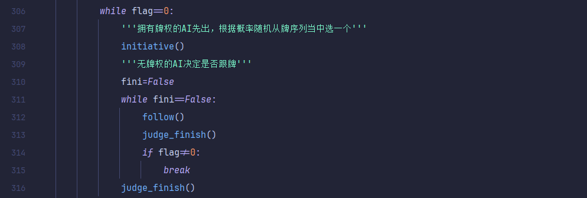<br>
#### 该阶段代码存在的问题 ####
&nbsp; &nbsp; &nbsp; &nbsp; 就像我上面提到的，在这个阶段的代码存在非常严重的问题，而且至今我也没有找到很好的方法去解决<br>
1. 在跟牌阶段AI会跟牌不符合规则，比如AI1出了[8 8]，AI2就会出[5 5]，很显然这是不被允许的，但是真实情况就是，我也写了判断大小的语句，也使用了
while循环使得既可以随机又可以符合规则，但是接踵而至的一个新的问题就是陷入死循环了，真的抓破头皮也不知道应该如何修改我的代码，于是乎只能放之任之了<br>
2. 生成对战数据的时候很明显有一个问题在于，对战回合数过多了，从一开始比较正常的三四十个回合，一直到之后的八九百个回合，我才意识到是我自己写的代码出现了严重的问题，
细细看数据集发现，到了最后几个回合双方的状态就一直停着不动了，我也不知道哪里出了问题，debug了好久也没有办法解决，最后只好放弃，选择了保留150行以内的数据集。
但是我深深地明白，这没有用的，我的数据集已经失败了，我也知道，最后不管怎么样用这样的数据集去跑剩下的代码，一定会出非常严重的错误，但是那有怎么样呢，
毕竟已经有了第一阶段的基础在那里了，第二阶段我更想要挑战一下思路，而不是一味地去追求AI对战能有多么完美对吧，不然大作业也失去了它的意义。<br>
3. 第一次使用Pandas的Dataframe类型的数据结构，很多操作用的非常不习惯，导致在生成数据集的时候频频出错，比如说访问某一行某一列的元素的时候，
Dataframe要求使用iloc方式去访问，添加某一行的时候需要用字典/列表去添加，很多都是现学现卖的，做的非常不习惯，最后的数据集还算能看的过去， 
一共生成了将近2500行的数据，这里先展示出一部分：
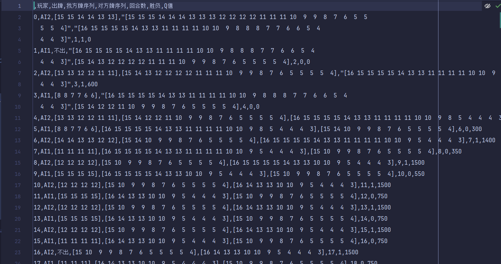<br>
### 2. 搭建并训练神经网络 ### 
&nbsp; &nbsp; &nbsp; &nbsp; 这一部分相对来说比较简单，但是属于全新的模块，之前从来没有写过，纯粹属于现学现卖，这次打算用pytorch模块去搭建一个神经网络
（因为pytorch将比较于Tensorflow和Keras来说更容易上手）<br>
首先先定义一个神经网络，其中神经网络输入由于向量长度不同是需要相应发生改变的，但是目前我想的是设定4个隐藏层，中间隐藏单元分别为120、40、20、10，
然后定义Relu激活函数实现非线性运算（如果我没有记错的话Relu函数好像是x小于0时y取0，x大于0的时候y=x，反正功能就是实现非线性变换）
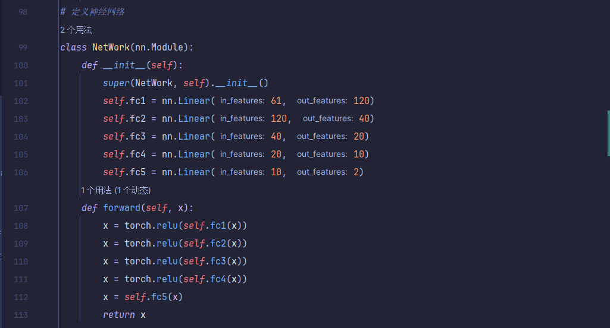<br>
&nbsp; &nbsp; &nbsp; &nbsp; 然后是对数据进行预处理，这是最麻烦的一个步骤了，之前生成数据集的时候我没有想太多，直接将每个玩家的状态列表存储进Dataframe里面去，然后再将整个
Dataframe保存为一个csv格式文件，然后再在神经网络模块中将其读取出来，但是现在问题就是读取出来的都是str类型的数据，我还想将其转换为tensor的格式
才能传进神经网络当中去，我相信pytorch一定有相应的方法能够实现，但是我找不到（哭死），只能一条数据一条数据地去处理，太麻烦了，这一段及其冗余，
这里还是不多加展示了，就是最终处理完以后的数据就是[我方出牌序列+我方牌数列+对方牌序列+回合数]并将其转化为tensor类型的数据作为x_train，
[胜负+Q值]并将其转换为tensor类型作为y_train（或者也可以理解为标签labels）
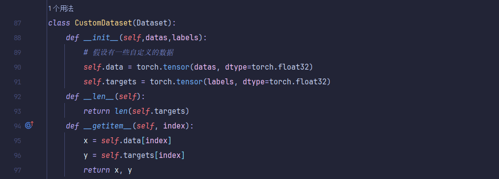<br>
&nbsp; &nbsp; &nbsp; &nbsp; 然后就到了神经网络的训练阶段了，神经网络的实现原理其实就是先初始化后经过多层的运算一直到输出层（前向传播），然后设定一个损失函数，
根据得到的预测结果与实际观测结果进行比较，将误差反向传播（逐层求导）并使用优化器optimizer对中间隐藏层的参数进行调整更新权重，
经过10轮（自己设置的）训练之后结束，最后得到了一个神经网络模型；然后进入测试阶段，其实按理来说是需要一些新的数据集的，但是懒得去找新的数据集，
直接用原本的数据集去测试，结果emmm……由于在生成数据集的过程中就已经有这样那样的问题了，就更别提想要最终的结果又多么准确了，这里直接给出最终的结果吧，
正确率只有惨淡的49%点多，这甚至不如直接瞎猜盲选乱出牌，都有一半的概率可以获胜，所以其实从某种程度来说，这一次的训练是完完全全失败的。
但是换个角度想，这毕竟也是第一次尝试嘛，毕竟能徒手撘一个神经网络出来已是相当不容易了，能跑通也是谢天谢地了。<br>
下面附上了训练神经网络的代码以及测试神经网络得到的惨不忍睹的结果：
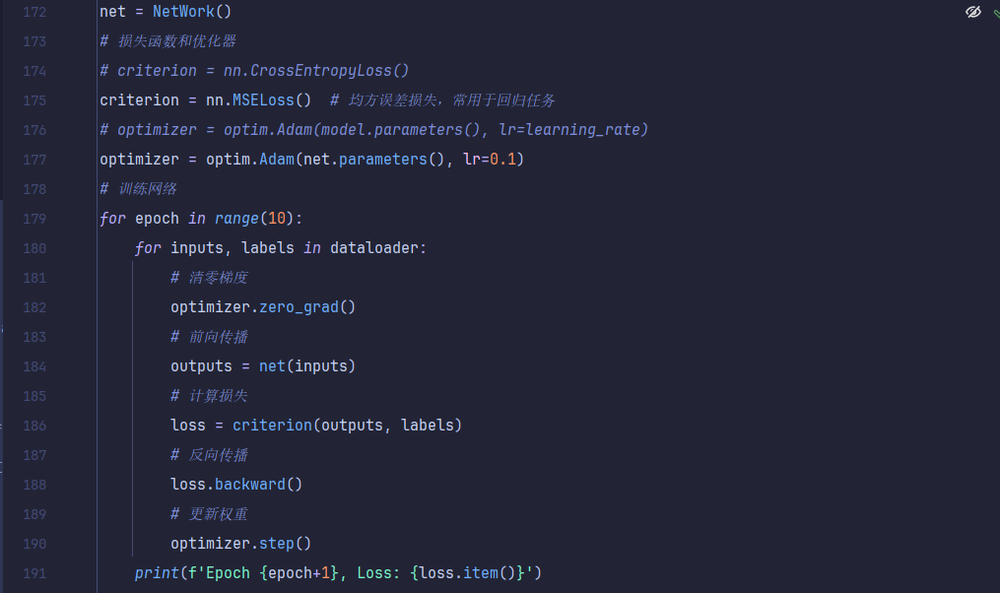<br>
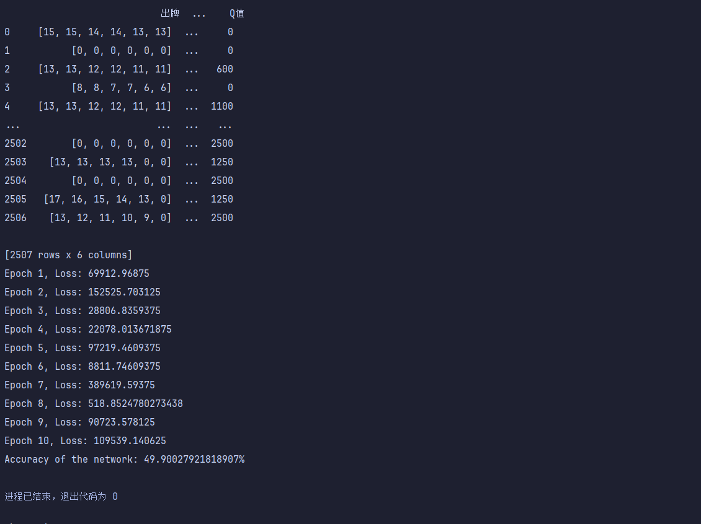<br>
### 3. 神经网络预测 ###
&nbsp; &nbsp; &nbsp; &nbsp; 在第三个子阶段主要完成的任务就是使用神经网络预测下一回合AI出什么牌以及
玩家与AI对战的可视化。<br>
&nbsp; &nbsp; &nbsp; &nbsp; 由于已经有第一阶段可视化操作的基础，在第二阶段再去实现可视化就会相对来说比较简单了。
但是仍旧会存在问题，由于第一阶段python刚起步写了很多屎山代码，到了第二阶段没有办法直接迁移过来使用，
不得不重新开了一个新的.py文件重新写，而且经过一定时间的修改，基本上已经可以实现一个大致的框架——
程序员只需要传入接下来需要出的牌的数字即可实现相应的出牌，就可以把更多的精力放在后端算法的优化上面，而不是在前端耗费太多时间。
在第一阶段已经有具体地阐述了基于规则的AI出牌以及可视化操作如何完成，在第二阶段不再赘述<br>
&nbsp; &nbsp; &nbsp; &nbsp; 在这个子阶段一个比较大的改动就是在AI起牌与跟牌阶段需要将出牌序列、AI手牌、玩家手牌、回合数传入神经网络并预测出Q值，
选取出最大的Q值对应的手牌序列并将其出掉。下面这张图给出了在AI起牌阶段将61维序列打包成一个tensor传进神经网络当中并且生成2维标签分别是输赢与Q值，
然后用循环选出Q值最大的那个出牌序列并出掉。这里需要注意几个问题：第一就是转换为tensor格式的时候需要使用到dtype=torch.float32参数，
否则由于数据类型不一致（会有Long和Float存在）会报错；第二个就是需要有一个torch.no_grad()函数存在，使得每一次神经网络BP反向传播的时候梯度不会累积；
第三就是生成的结果是有两个的，需要取出第二个结果（也就是Q值），并且使用到.item()方法将tensor.float32格式的数据转化为python自带数据类型<br>
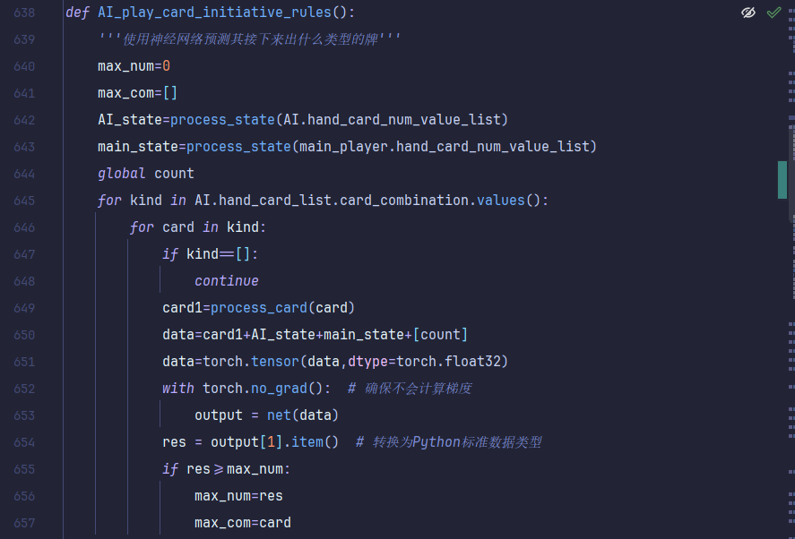
&nbsp; &nbsp; &nbsp; &nbsp; 然后再global frame当中需要实例化一个神经网络的对象，
并且加载进在“NeuralNetwork.py”当中就已经保存好的net.pth（使用状态字典）参数，
之后再需要使用神经网络进行预测的话就可以直接使用即可<br>
&nbsp; &nbsp; &nbsp; &nbsp; 至于其他的代码具体细节这里就不再贴了，在第一阶段的报告当中已经写的非常明确。
但是还是想说一下第一阶段和第二阶段可视化实现的一个最大的区别，在第一阶段我仍旧摆脱不了固有思维，认为玩家手牌只能是['3','4','5',……,'大王']之类的，
但是实际上只需要默认其对应的数字即可，并不一定需要使用到字符串，这样反而更麻烦，直接用映射的方式去替代反而简洁明了高效。<br>
&nbsp; &nbsp; &nbsp; &nbsp; 另外在压缩包当中也会附上演示的视频文件，可以直接去看最后的演示结果<br>
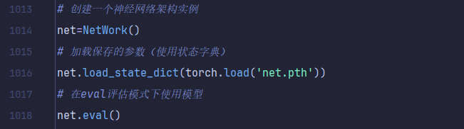


## 项目当中遇到的问题以及相应的改进措施： ## 

### 特征数量过多过于庞大 ###
&nbsp; &nbsp; &nbsp; &nbsp; 最后在训练神经网络的过程中的x_train的值是一个向量，足足有高达60维的向量，这个特征数量还是太大了。
原因其实是因为我无脑地直接将我方与对方牌序列直接组合成一个向量传进去，不足的部分用0补上，其实这对维数是一个大大的浪费。
后来其实想了一下可以考虑用类似于[17 1 16 2 15 3 14 0 13 4 ……]这样的格式，表明大小为17、16、……的牌的数目分别有1、2、……张，
这样就可以将维数压缩成30，如果更加大胆一点的话直接就变成了15，这样就可以极大地降低维数。当然由于时间限制，这里就不再演示修改之后的代码了。
等之后有时间了再重新回头对代码进行相应的修改。


### 奖励值Q的设定过于困难 ###
&nbsp; &nbsp; &nbsp; &nbsp; 在具体实现过程中我发现一个致命的难题就是这个Q值的设定问题，如果说最后Q值仅与胜负有关，
那么在不同回合下，可能出了同一手牌胜负是不一样的，于是我将Q值与回合数与目前拥有的手牌数相挂钩，设定公式为：<br>
&nbsp; &nbsp; &nbsp; &nbsp; Q值=(27-目前所拥有的牌)*胜利与否（100 / 50）<br>
&nbsp; &nbsp; &nbsp; &nbsp;但是后来又发现了一个问题，我在训练的时候了是把胜负作为特征放进去的，但是实际上在预测的时候胜负就是我们需要预测的东西，
然后再根据胜负与Q值去决策应该要去选择出哪一手牌


## 项目本身存在的问题以及未来可以改进的方向 ## 
&nbsp; &nbsp; &nbsp; &nbsp; 其实在一开始就已经说了，DQN才是更为科学的方法，而单纯使用一个神经网络去预测每一个出牌究竟收益如何本身就不是非常科学。
第一是Q值设定问题很困难；第二是每一步出的牌对于剩下拥有牌的组合产生的影响就完全没有考虑；第三就是神经网络这个工具本身的可解释性以及训练过程的科学性。<br>
&nbsp; &nbsp; &nbsp; &nbsp; 等之后不是非常忙碌的时候，我可能会重新回来审视一下自己的项目，并且好好学习一下神经网络的具体搭建以及数据集
处理问题，对于数据处理部分是需要一定的numpy与pandas的基础的，除此之外还需要好好学习一下Q-Learning以及DQN算法的具体实现以及如何应用到扑克牌相关的游戏当中去。<br>
&nbsp; &nbsp; &nbsp; &nbsp; 在QQ群里助教也发过国外有关于使用决策树与随机森林来实现扑克牌游戏的文章，而这个思路我曾经也思考过，但是由于
特征工程、拆牌影响等一系列问题，最终还是放弃了这个方案，之后有空的话可以再重新回过头来思考一下这个想法

